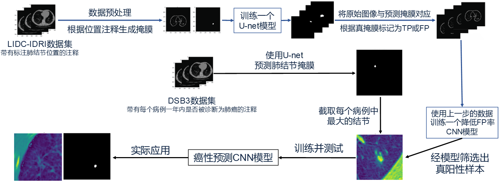

# 基于深度学习的肺结节识别
个人毕业设计，一个分别使用U-net与CNN进行肺结节分割与分类的简单项目。

* 主要参考了[这个项目](https://github.com/mikejhuang/LungNoduleDetectionClassification)的代码，感谢这位开发者的贡献
* 使用[PyTorch](https://github.com/pytorch/pytorch)重新编写模型构建代码。

## 技术路线



* 1.读取数据集与数据预处理。获取LIDC数据集，并将其处理为适合图像分割的输入数据结构。
* 2.构建并训练U-net网络。训练一个U-net卷积神经网络进行结节的图像分割，这个U-net网络将预测结节的位置，并生成一个对应的掩膜图像。
* 3.降低假阳性。U-net网络的一个限制是，它可能会认为每个图像都含有至少一个肺结节，然而实际情况是有的图像没有肺结节，这会导致假阳性，即出现误报。所以要使用真假阳性的标签来训练一个用于分类的卷积神经网络，通过该网络处理U-net网络的结果，从而降低假阳性率。理想情况下，这个CNN将大幅度降低假阳性，同时只轻微降低真阳性。
* 4.读取第二个数据集，并从中提取结节。获取包含有癌性或非癌性标签的DSB3数据集，从该数据集中提取肺结节，并从每个患者的CT影像中分离出最大的结节。
* 5.训练癌性预测卷积神经网络。构建并训练一个可以将将结节标记为癌性或非癌性的卷积神经网络模型，并使用前述的几个模型（综合称为肺结节识别模型）对实际的医院诊断数据进行处理与预测。

## 环境配置
参照[requirements.txt](requirements.txt)，这里给出主要的软件包版本：
* Python=3.12.2
* PyTorch=2.2.1
* pydicom=2.4.4
* jupyterlab=4.0.11

建议使用[Anaconda](https://www.anaconda.com)进行环境的搭建与管理

pip:
```
pip install -r requirements.txt
```
conda:
```
conda env create -f environment.yml
```
